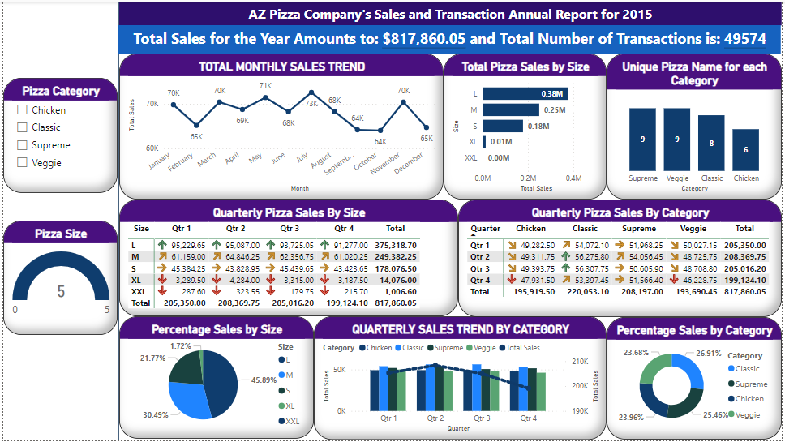

# AZ-Pizza-Company-Sales-Report-Documentation


**Documentation Outline**
- [Project Overview](#project-overview)
- [Data Sources](#data-sources)
- [Tools Used](#tools-used)
- [Data Cleaning and Preparation](#data-cleaning-and-preparation)
- [Data Analysis](#data-analysis)
- [Results and Findings](#results-and-findings)
- [Conclusion and Recommendations](#conclusion-and-recommendations)

## Project Overview
This Data Analysis project aims to get insight from the AZ Pizza Company's Annual Sales data. By analyzing the various parameters in the data set,
I seek to understand sales performance over the months of the different categories of pizza product the company produce. 

## Data Sources
The primary source of Data used is pizza_sales.xlsx and this is open source data that was freely downloaded from an open source online data repository site "kaggle"

## Tools Used
- Google
- Power BI
- Power Query Editor

## Data Cleaning and Preparation
The dataset consists of four tables (Pizza sales, Pizzas, Pizza types and Orders) and data cleaning was done for each table.

**Pizza Sales Table**

The cleaning done on this table include
- Promoted Headers: The first row was used as the header
- Change Type: The data type of the columns were change from any to their appropriate data types
- Renamed Columns: The columns were meaningfully renamed

**Pizzas Table**

The cleaning done on this table include
- Promoted Headers: The first row was used as the header
- Change Type: The data type of the columns were change from any to their appropriate data types
- Renamed Columns: The columns were meaningfully renamed

**Pizza Types Table**

The cleaning done on this table include
- Promoted Headers: The first row was used as the header
- Change Type: The data type of the columns were change from any to their appropriate data types
- Renamed Columns: The columns were meaningfully renamed

**Orders Table**

The cleaning done on this table include
- Promoted Headers: The first row was used as the header
- Change Type: The data type of the columns were change from any to their appropriate data types
- Split Columns By Delimiter: The time column that consists of time and date was splitted
- Removed Columns: The columns that were not needed for the analysis were removed  
- Renamed Columns: The columns were meaningfully renamed

## Data Analysis

The dataset only provided quantity sold and the price for each pizza product by size. There was no provision for total sales.

To obtain the total sales, which will help us understand sales by category, quarterly or monthly,
a DAX expression was written as follows:
```
Total Sales = SUMX(pizza_sales, pizza_sales[Quantity] * RELATED(pizzas[Price]))
```

## Results and Findings

some of the insight drived from the pizza sales dataset are as follows:
- AZ Pizza Company made a total sales of **$817,860.05** in **49574** transactions
- AZ Pizza Company produces four categories of Pizza of 5 different sizes
- "Large Size" sales makes up about 46% of AZ Pizza Company's sales for the Year, in all category
- "XXL Size" sales turns out the least sales about 2% for the Year and it is only available for the "Classic" category
- AZ Pizza Company made their monthly highest sales in the month of "July" but thier quarterly highest sales happened in the second quarter


## Conclusion and Recommendations
From the analysis done, the following are the conclusions we reached;
1. 
2. Majority of the students are Males and Singles and around the age range of 25-29

It is clear from our analysis from the given dataset that youthful and single Nigerians are very interested in learning new tech skills.
Also it is clear that SkilHarvest Academy has very little presence in other Afrian countries.

## Recommendation
SkilHarvest Academy should increase their advertisments in the other African countries, to give same opportunity to the youths of those countries.
